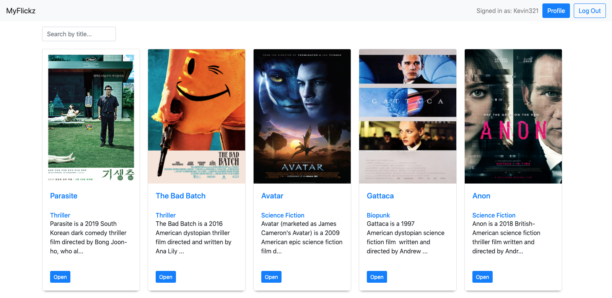

# MyFlickz 

### A full stack project built using the **MERN** stack.

#### Client Side:
The UI was built using **React**, and handles data requested by the user through the REST API [endpoints](https://github.com/kevmhughes/MyFlickz/blob/main/README.md#endpoints) defined below.

#### Server Side:
The **REST API**, and database, were built using **JavaScript**, **Node.js**, **Express**, and **MongoDB**.

# Description
**MyFlickz** is a film buff's dream. It is essentially a database of movies, genres, and directors, where users can browse through a large selection of films and enrich their knowledge of cinema. 

### Users can:

* create an account.
* see all the movies in the database.
* get detailed information on a single movie by movie title.
* get detailed information on a genre by genre name, and view other movies in the same genre.
* get detailed information on a director by name, and view other movies from the same director.
* create a list of their favourite movies.
* update their user information.
* delete their account.

# Take a Look at the App
<kbd>

</kbd>

# Endpoints

Here...

### Dependencies
    "bcrypt": "^5.0.1",
    "body-parser": "^1.19.0",
    "cors": "^2.8.5",
    "express": "^4.17.1",
    "express-validator": "^6.10.0",
    "jsonwebtoken": "^8.5.1",
    "lodash": "^4.17.21",
    "mongoose": "^5.11.18",
    "morgan": "^1.10.0",
    "passport": "^0.4.1",
    "passport-jwt": "^4.0.0",
    "passport-local": "^1.0.0",
    "react-router-dom": "^5.2.0",
    "uuid": "^8.3.2"

# Tools Used

### Development Environment
* Node.js

### Libraries & Frameworks
* React 
* Mongoose
* Express 

### Database
* MongoDB

### Hosting
* Heroku

### Other
* Postman
* Parcel 
* React Redux
* Bootstrap

